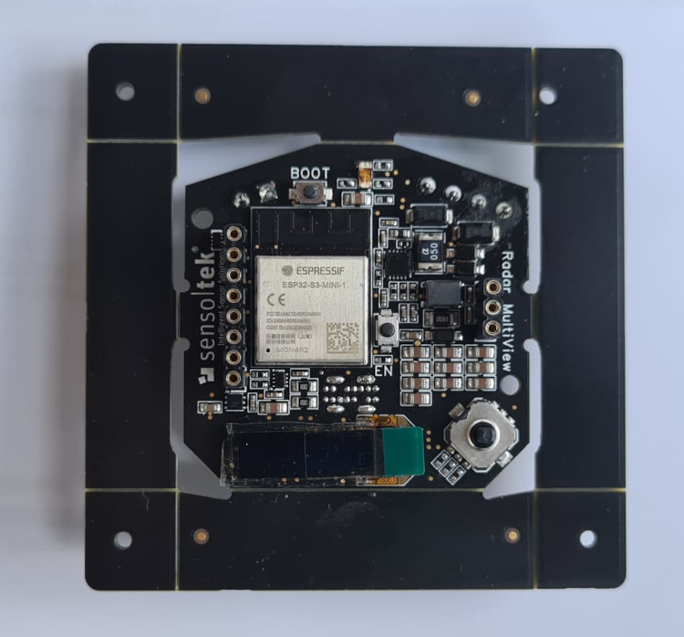
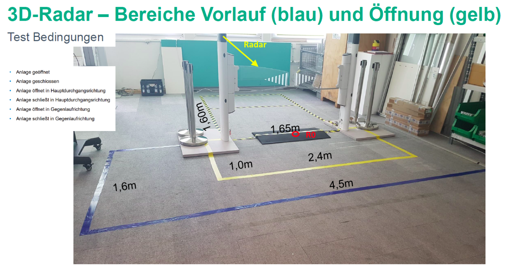

# ESP32-S3 mmWave Gate Sensor using V-LD3

<p float="left">
  
  
</p>

💡 **Observations:**  

- mmWave configuration (.cfg) inside **mmWaveConfig.h** file;
- If using V-LD3 eval kit, then R220 needs to be removed. This is to avoid bus conflict between FTDI TX line and ESP32 TX line;
- Use the same TX and RX pins on the RMV board that were previously used for the K-LD7.
- Gate application



## 🖥️  Viewer Communication

- Baud Rate: 921600 bps
- Data Format: 8 data bits, no parity, 1 stop bit (8N1)
- Port: USB (mapped as a virtual COM port on the host system)

## 📤 JSON Output Format — Gate Application

This document describes the structure of the JSON frames sent by the radar gate system running on ESP32S3.
Each JSON message is serialized in a single line and terminated with a carriage return and newline (\r\n).
This makes it easier to parse over serial/UART or network streams where line-based processing is expected.
The communication topology is master x slave, with the sensor acting as slave (it will not start a communication, except for the log messages when ESP32 is booting).
Some fields are common to all JSON messages:

- `"id"` (integer): Sensor address on the bus. For single‑sensor setups, always use `1`.
- `"cmd"` (string): Command verb for the message. Implemented commands are:
  - `"get"`: request next sensor frame
  - `"cfg"`: send configuration file (.cfg) as a string inside field "file". The cfg message also includes a crc field 
  - `"status"`: request the sensor status

- `"res"` (object|string): Reply payload. An **object** on success (e.g., frame data) and a **string** on status/error (e.g., `"busy"`, `"error"`).

> Notes
> - For multi‑sensor deployments, set `id` to the target sensor’s address (1..N).
> - Parsers are whitespace‑tolerant; however, **CRC verification must use the exact raw bytes** as received.

### Request frame message

Message from host :arrow_right: ESP32
```json
{"id":1,"cmd":"get"}␍␊
```

Response to host :arrow_left: ESP32
```json
{"id":1,"cmd":"get","res":"error"}␍␊
```
The response "error" means the sensor is not configured yet.

So the host computer should send the configuration message. 

### Configuration Message

The configuration is a serialization of the .cfg file, with a '\n' to separate each line. The last field should be the "crc" field (CRC32). The CRC is calculated only over the file contents (contents of "file" field).
The ESP32 validates the CRC using **CRC-32/MPEG-2** as specified in the CRC section below.

Message from host :arrow_right: ESP32

```json
{"id":1,"cmd":"cfg","file":"sensorStop 0\nchannelCfg 7 3 0\nchirpComnCfg 10 0 0 128 4 28 0\nchirpTimingCfg 6 32 0 100 57.5\nframeCfg 2 0 250 32 100 0\nantGeometryCfg 1 0 0 1 1 2 1 1 0 2 1 3 2.5 2.5\nguiMonitor 2 3 0 0 0 1 0 0 1 1 1\nsigProcChainCfg 32 2 3 2 8 8 1 0.3\ncfarCfg 2 8 4 3 0 12.0 0 0.5 0 1 1 1\naoaFovCfg -70 70 -40 40\nrangeSelCfg 0.1 10.0\nclutterRemoval 1\ncompRangeBiasAndRxChanPhase 0.0 1.00000 0.00000 -1.00000 0.00000 1.00000 0.00000 -1.00000 0.00000 1.00000 0.00000 -1.00000 0.00000\nadcDataSource 0 adc_data_0001_CtestAdc6Ant.bin\nadcLogging 0\nlowPowerCfg 0\nfactoryCalibCfg 1 0 40 0 0x1ff000\nboundaryBox -3.075 1.425 0 3.0 0.2 3\nsensorPosition 0.825 0 1.3 -45 -30\nstaticBoundaryBox -2.025 0.375 0 1.0 0.3 3\ngatingParam 3 2 2 2 4\nstateParam 3 3 12 50 5 200\nallocationParam 6 10 0.1 4 0.5 20\nmaxAcceleration 0.4 0.4 0.1\ntrackingCfg 1 2 100 3 61.4 191.8 20\npresenceBoundaryBox -3.075 1.425 0 3.0 0.2 3\nmicroDopplerCfg 1 0 0.5 0 1 1 12.5 87.5 1\nclassifierCfg 1 3 4\nbaudRate 1250000\nsensorStart 0 0 0 0\n","crc":224053240}␍␊
```

Response to host :arrow_left: ESP32

If JSON message is valid and CRC is correct, the ESP32 will respond "done" like this:

```json
{"id":1,"cmd":"cfg","res":"done"}␍␊
```

The response is immediate, before all commands were actually sent to the mmWave sensor. While the sensor is being configured, in case a "get" command is received, the response will be "busy":

```json
{"id":1,"cmd":"get","res":"busy"}␍␊
```

The busy state lasts only for a few seconds. In case the sensor does not accept the configuration, the ESP32 will try for up to 5 times to send the configuration commands. If the configuration is not succeeded, the ESP32 will respond "error" to the get messages after 6 seconds, then the host computer should try sending the configuration again.

## Detection messages

If the configuration is succeeded, the ESP32 will receive the frame messages from the sensor and report the next frame when the "get" message is received. The ESP32 will also include a CRC field that can be used to validate the frame information:

Each frame corresponds to a parsed radar data packet and includes:

- Timestamp and frame number
- Tracked targets (with position, velocity, acceleration, classification)
- *(Optional)* Detected point cloud (to be added)
- The json is transmitted as a single line ended with "\r\n"

---

## 🧪 Example JSON — `get` reply (success)

```json
{"id":1,"cmd":"get","res":{"frame":835,"dt":100,"persons":1,"use_case":[],"tgt":[{"id":2,"x":0.737,"y":0.524,"z":-0.000,"vx":0.123,"vy":-0.093,"vz":-0.000,"ax":0.231,"ay":-0.138,"az":-0.000,"cf":0.991,"gf":3.000}]},"crc":1131263550}␍␊
```

**Field meanings**

- `id` *(int)* — Sensor address on the bus. For single-sensor setups use `1`.
- `cmd` *(string)* — Echoed command verb. Here it is a reply to `get`.
- `res` *(object)* — Command payload:
  - `frame` *(int)* — Frame counter since boot/config.
  - `dt` *(int, ms)* — Time since previous frame (milliseconds).
  - `persons` *(int)* — Number of persons tracked in current frame.
  - `use_case` *(list)* — List of use cases IDs in current frame (see table 1). If no use case detected, the list will be empty ([]).
  - `tgt` *(array)* — List of detected targets (zero or more). Each target:
    - `id` *(int)* — Track identifier (unique while the track is active).
    - `x`, `y`, `z` *(float, meters)* — Position in the configured coordinate system.
    - `vx`, `vy`, `vz` *(float, m/s)* — Velocity components.
    - `ax`, `ay`, `az` *(float, m/s²)* — Acceleration components.
    - `cf` *(float, 0…1)* — Confidence factor (1.0 = highest confidence).
    - `gf` *(int)* — Group/class flag from firmware (semantics may vary by build).
- `crc` *(uint32, decimal)* — Optional checksum over the `res` block (telemetry).  
  *Note:* The CRC is calculated over entire `res` field, including the brackets "{...}". The receiver should calculate over the received String, since JsonLoads

#### Error case

If the sensor isn’t configured (e.g., after reset), the reply is:

```json
{"id":1,"cmd":"get","res":"error"}\r\n
```

Send a `cfg` message (with `file` and `crc32`) before requesting frames again.

#### ⚠️ CRC on detection messages — short note

* **Don’t use `json.loads` to compute/verify CRC.** Parsers change bytes (key order, whitespace, number formats like `-0.000`), breaking CRC.
* **Compute CRC over the exact raw bytes** the device claims to protect.

  * For `get` replies like `{"id":1,"cmd":"get","res":{...},"crc":377880932}\r\n`:
    CRC is over the **`res` object bytes only** — from the `{` right after `"res":` to its matching `}` (inclusive), exactly as received.
* **Algorithm:** CRC-32/CKSUM (poly 0x04C11DB7, init 0x00000000, refin/refout true/true, xorout 0x00000000).

* **Procedure:** read the line as **bytes** → slice the `res` `{...}` span → CRC-32/MPEG-2 on that slice → compare with `crc` (decimal).

On ESP32, the CRC is calculated with this function:

```c
extern "C" {
  #include "esp32/rom/crc.h"
}
...
uint32_t calc_crc = crc32_le(0, (const uint8_t*)cfg.c_str(), cfg.length());
```

A Python script was created to read the .cfg file and send to ESP32 for tests and validation. This script is located in python folder, and can be executed in Linux like this:

```powershell
python command.py -f gate.cfg --port /dev/ttyACM0
```

If -f file is not provided, then a `get` command is issued:

```powershell
python command.py --port /dev/ttyACM0
```

### Use cases

This table shows all planned use cases:

| Use Case | ID                                |
| ----- | ------------------------------------------ |
| Tailgating | 1   |
| Unterkriechen | 2   |
| Sicherheitszonen | 3   |
| Gegenlaufverstoß | 4   |
| Unerlaubt. Übersteigen | 5   |
| Durchgang mit Trolley | 6   |
| Unerlaubtes Offenhalten | 7   |
| Aufdrücken | 8   |
| Überwachen des Schwenkbereiches | 9   |
| Querverkehr | 10  |

_Table 1: Use Cases ID_

### Status message

To read the status message, which includes firmware version, date and sensor state,  the following message can be used:

Message from host :arrow_right: ESP32

```json
{"id":1,"cmd":"status"}\r\n
```

Response to host :arrow_left: ESP32

```json
{"id":1,"cmd":"status","res":"V103, (05.10.2025), State:4"}␍␊
```

Response meaning:

- `V103` = firmware version
- `05.10.2025` = firmware date
- `State:n` = mmWave sensor state
  - `State:0` = Idle state, sensor not configured, waiting for "cfg" message
  - `State:1` = Reading next configuration line
  - `State:2` = Sending configuration line to mmWave sensor
  - `State:3` = Waiting for echo from mmWave Sensor
  - `State:4` = Sensor configured and running
  - `State:5` = Reading TLV data from sensor

In normal operation after configuration, sensor state will be 4 (or 5 eventually).

### Configuration file used

This is the configuration file used during the tests. It can be changed as needed, but be sure to keep the track report (TLV 308) enabled.

```powershell
sensorStop 0
channelCfg 7 3 0
chirpComnCfg 10 0 0 128 4 28 0
chirpTimingCfg 6 32 0 100 57.5
frameCfg 2 0 250 32 100 0
antGeometryCfg 1 0 0 1 1 2 1 1 0 2 1 3 2.5 2.5
guiMonitor 2 3 0 0 0 1 0 0 1 1 1
sigProcChainCfg 32 2 3 2 8 8 1 0.3
cfarCfg 2 8 4 3 0 12.0 0 0.5 0 1 1 1
aoaFovCfg -70 70 -40 40
rangeSelCfg 0.1 10.0
clutterRemoval 1
compRangeBiasAndRxChanPhase 0.0 1.00000 0.00000 -1.00000 0.00000 1.00000 0.00000 -1.00000 0.00000 1.00000 0.00000 -1.00000 0.00000
adcDataSource 0 adc_data_0001_CtestAdc6Ant.bin
adcLogging 0
lowPowerCfg 0
factoryCalibCfg 1 0 40 0 0x1ff000
boundaryBox -3.075 1.425 0 3.0 0.2 3
sensorPosition 0.825 0 1.3 -45 -30
staticBoundaryBox -2.025 0.375 0 1.0 0.3 3
gatingParam 3 2 2 2 4
stateParam 3 3 12 50 5 200
allocationParam 6 10 0.1 4 0.5 20
maxAcceleration 0.4 0.4 0.1
trackingCfg 1 2 100 3 61.4 191.8 20
presenceBoundaryBox -3.075 1.425 0 3.0 0.2 3
microDopplerCfg 1 0 0.5 0 1 1 12.5 87.5 1
classifierCfg 1 3 4
baudRate 1250000
sensorStart 0 0 0 0
```

### 📦 Top-Level Fields

| Field | Type | Description |
|---|---|---|
| `id`  | int    | Sensor address on the bus. For single-sensor use `1`. |
| `cmd` | string | Command verb (`get`, `cfg`, `status`). |
| `res` | object or string | Reply payload — object on success (e.g., frame data) or string on status/error (`"busy"`, `"error"`). |
| `crc` | uint32 (decimal) | **Detection replies only:** CRC over the raw bytes of `res` (see CRC note). |

### 🔹 frame Object

| Field | Type | Description                                |
| ----- | ---- | ------------------------------------------ |
| `frame` | int  | Frame number reported by mmWave sensor   |
| `dt`  | int  | Time delta from last frame in milliseconds |
| `persons` | int  | Number of persons in current frame |
| `use_case`  | list | List of detected use cases ID |

### 🔹 targets Array

Each element corresponds to a detected and tracked object.
Data extracted from TLV 308 (Target List), part of the radar’s tracking engine.

| Field | Type  | Description                                              |
| ----- | ----- | -------------------------------------------------------- |
| `id`  | int   | Target ID (stable while target is tracked)               |
| `x`   | float | Position X [meters]                                      |
| `y`   | float | Position Y [meters]                                      |
| `z`   | float | Position Z [meters]                                      |
| `vx`  | float | Velocity X [m/s]                                         |
| `vy`  | float | Velocity Y [m/s]                                         |
| `vz`  | float | Velocity Z [m/s]                                         |
| `ax`  | float | Acceleration X [m/s²]                                    |
| `ay`  | float | Acceleration Y [m/s²]                                    |
| `az`  | float | Acceleration Z [m/s²]                                    |
| `cf`  | float | Classification confidence (0.0 to 1.0)                   |
| `gf`  | int   | Group or classification ID (e.g., person, vehicle, etc.) |

- Fields are truncated to 3 decimal places;
- All coordinates are expressed relative to the R0 reference point, where (0, 0, 0) denotes the R0 origin;
- Units are metric;
- If no targets are detected in a frame, the `tgt` array will be empty or omitted inside `res`.

### Raw Point Cloud — "raw" Field

When the "cmd" is "raw", the JSON response is a superset of the "get" response.
All fields present in "get" are still provided (e.g., res.frame, res.dt, res.persons, res.use_case, res.tgt, …), plus an extra array res.raw that carries the instantaneous radar detections (point cloud) for the current frame.

Message from host :arrow_right: ESP32

```json
{"id":1,"cmd":"raw}␍␊
```

The ESP32 will reply the same message obtained with the "get" command, but adding the field "raw". 

```json
{"id":1,"cmd":"raw","res":{"frame":173660,"dt":100,"persons":1,"use_case":[],"tgt":[{"id":0,"x":-0.135,"y":0.773,"z":0.000,"vx":-0.058,"vy":0.109,"vz":-0.000,"ax":-0.154,"ay":0.469,"az":0.000,"cf":0.997,"gf":3.000}],"raw":[{"id":0,"x":-0.144,"y":0.730,"z":0.000,"v":0.321,"snr":17.500},{"id":1,"x":-0.140,"y":0.743,"z":0.000,"v":0.321,"snr":16.750}]},"crc":1225987504}␍␊
```

In case there are no raw detections, the "raw" field is reported empty ("raw":[]).

Each element of "raw" corresponds to one radar detection point, with the following fields:

| Field | Type       | Units                   | Description                                                                                                                                                   |
| ----- | ---------- | ----------------------- | ------------------------------------------------------------------------------------------------------------------------------------------------------------- |
| `id`  | `uint32_t` | —                       | Point index within the current frame (starting with 0)(0-based).                                                                                                               |
| `x`   | `float`    | meters (m)              | Cartesian X-coordinate of the detected point relative to the sensor. Positive X usually points **right** from the radar’s perspective.                        |
| `y`   | `float`    | meters (m)              | Cartesian Y-coordinate (forward distance) relative to the radar.                                                                                              |
| `z`   | `float`    | meters (m)              | Cartesian Z-coordinate (height). Often near zero for ground-plane measurements.                                                                               |
| `v`   | `float`    | meters per second (m/s) | **Radial velocity** of the detection (Doppler-measured). Positive indicates the object is **moving away** from the radar; negative indicates **approaching**. |
| `snr` | `float`    | decibels (dB)           | **Signal-to-Noise Ratio** of the detection, indicating detection strength or confidence. Higher values correspond to stronger reflections.                    |

### 📄 Changelog

- **V104 (12.10.2025)**
  - Included "raw" command - same reply as "get", but including cloud of points ("raw" field is added as explained in this README).
  - Fixed CRC descrition

- **V104 (08.10.2025)** 
  - Tailgating and cross traffic use cases included

> ### 🧭 Use Cases Conditions
>
> **Tailgating**
> 
> - Condition: exists a pair (i, j) such that  
>   - `yᵢ < 2 m` and `yⱼ < 2 m`  
>   - `|xᵢ − xⱼ| ≤ 1 m`  
>   - `|yᵢ − yⱼ| ≤ 1 m`
>
> **Cross Traffic**
> 
> - Condition: target below 2 m
> - `|vx| > 0.3 m/s` and `|vy| < 0.2 m/s`

- **V103 (05.10.2025)** — Updates defined in the 01.10.2025 meeting (Yannik & Claudio):
  - All host↔ESP32 messages use the JSON schema described in this document.
  - ESP32 acts as a slave and only transmits on request via the `get` command.
  - Sensor configuration happens only on `cfg`. The payload includes a `file` field with the `.cfg` text and a `crc` field for integrity.
  - After a sensor reset, a `get` reply returns an `"error"` to signal that a new `cfg` is required before measurements resume.
  - ESP32 does not evaluate zones; it only reports targets. Zone logic is handled by the Linux host.
  - Higher measurement rates are supported (as defined in the `.cfg` file).
- **v1.0**: Initial JSON schema for targets and zones
